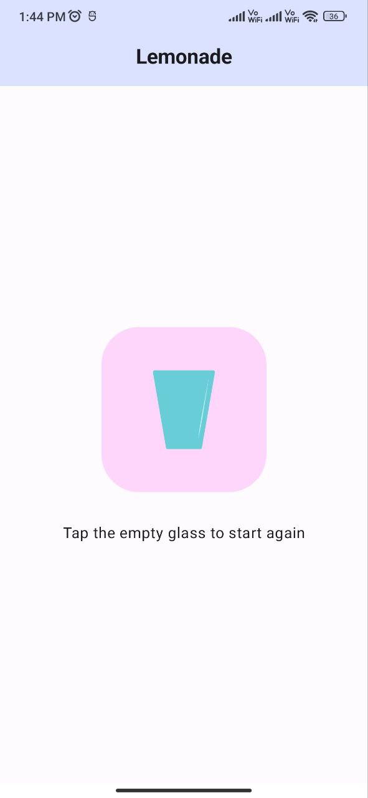

# Lemonade App in Jetpack Compose

This project builds a "Lemonade" app using Jetpack Compose for Android. Users can create virtual lemonade by following these steps:

1. Pick a lemon from the tree.
2. Squeeze the lemon.
3. Enjoy the glass of lemonade!
4. Start over for another round.

## Features

* Pick a virtual lemon from a tree.
* Squeeze the lemon to fill a glass.
* Drink the refreshing lemonade.
* Reset the app to start a new lemonade-making session.

## Getting Started

- Clone this repository or create a new Android project in Android Studio.
- Open the `MainActivity.kt` file.
- Add the necessary Compose components (Image and Button) to create the Lemonade app interface.
- Implement the logic to track the current lemonade-making stage using state variables.
- Update the UI elements based on the current stage (lemon tree, squeezing, drinking, or reset).

## Usage

- Build and run the app on an Android emulator or physical device.
- Tap the buttons to pick a lemon, squeeze it, drink the lemonade, and start over.

## What You'll Need

- A computer with Android Studio installed.

## Screenshots

  

  

